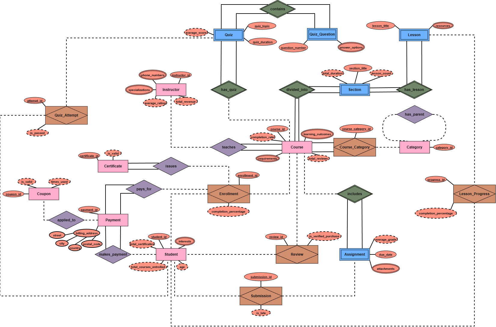
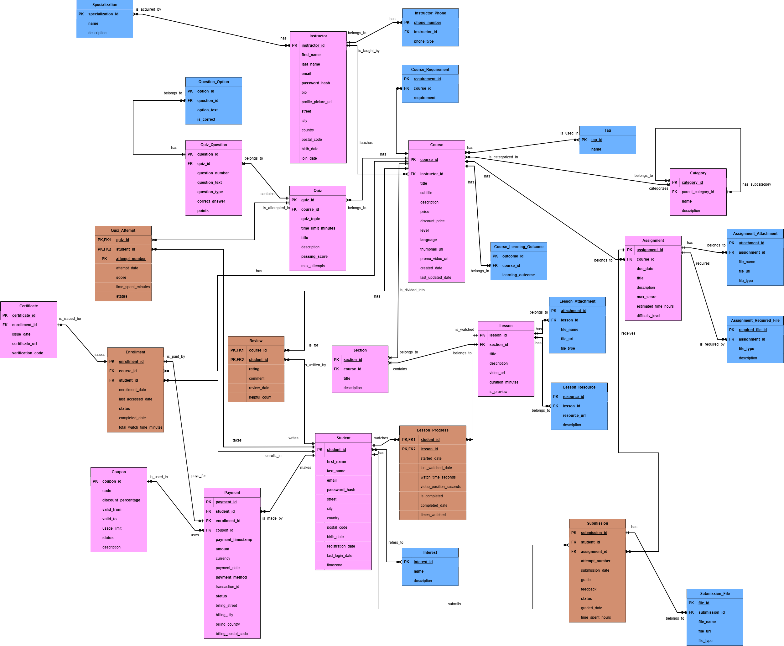
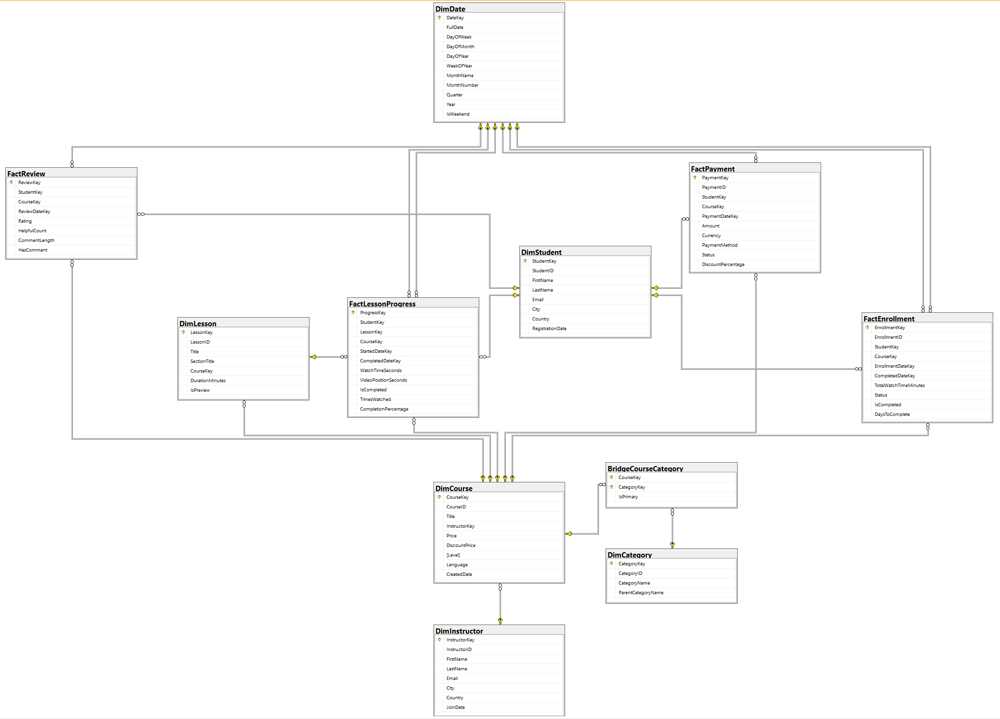
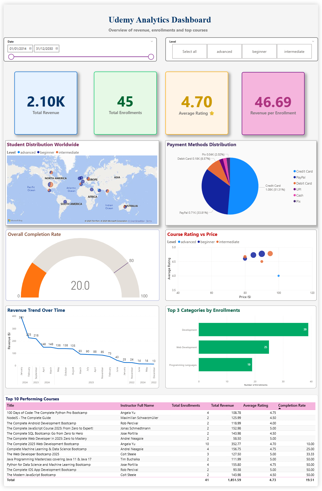
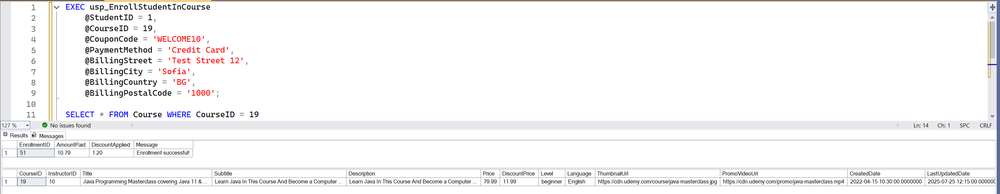
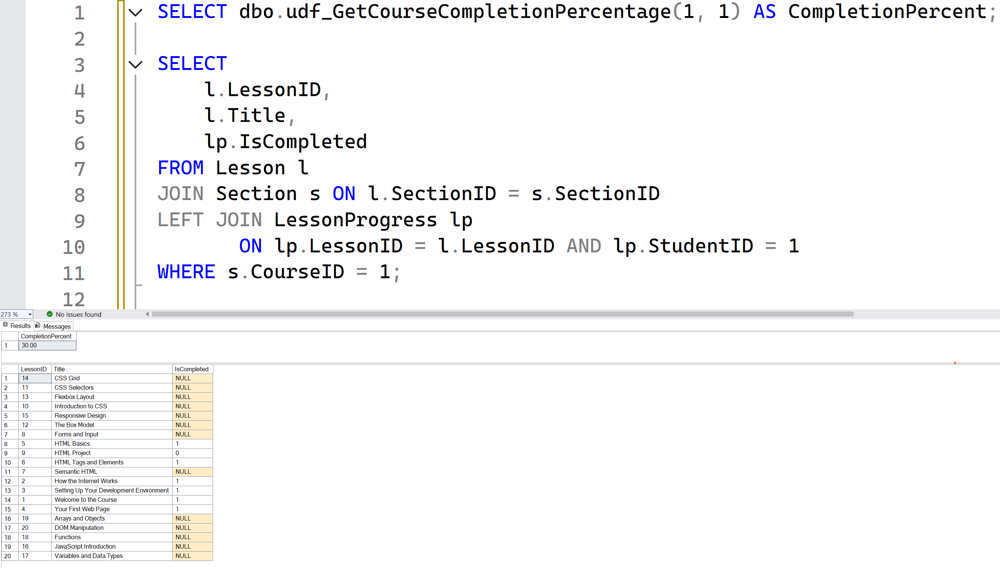
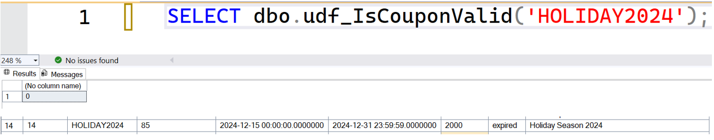
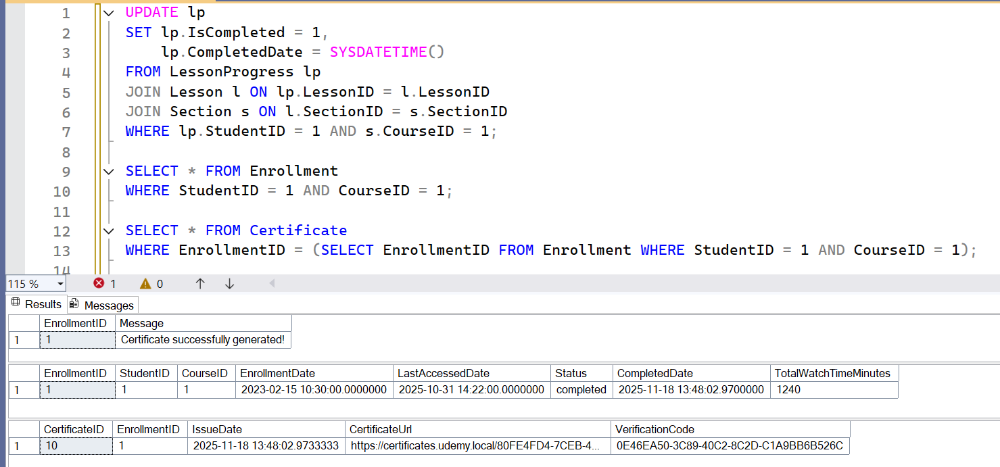
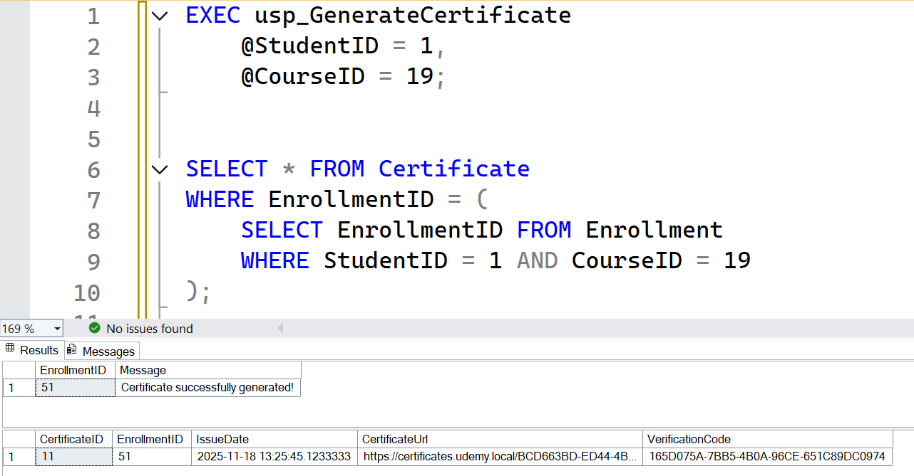

# Udemy Platform - Database System

## Информация за студента
- **Име:** Атанас Гюлчев
- **Факултетен номер:** 2301321018
- **Проект:** Udemy - Онлайн платформа за обучение

## Описание

Проектът представлява пълна база данни и аналитична система за онлайн образователна платформа тип Udemy. Включва OLTP база за оперативна работа и Data Warehouse за бизнес анализи.

## Технологии
- **Database:** Microsoft SQL Server
- **Business Intelligence:** Power BI
- **Modeling:** Draw.io (Chen's notation, Crow's Foot, UML)

## Концептуален модел



## Логически модел



## База данни

### OLTP База (UdemyDB)
Системата съдържа **15+ таблици**, организирани в следните модули:

**Потребители:**
- Student, Instructor, Interest, Specialization

**Курсове:**
- Course, Category, Section, Lesson
- Quiz, Assignment, Review

**Транзакции:**
- Enrollment, Payment, Coupon, Certificate
- LessonProgress, QuizAttempt, Submission

**Функционалности:**
- **2 Stored Procedures** - Записване в курс, генериране на сертификат
- **2 Functions** - Валидация на купони, изчисляване на прогрес
- **1 Trigger** - Автоматично завършване и сертифициране

### Data Warehouse (UdemyDW)



**Fact Tables (4):**
- FactEnrollment, FactPayment, FactLessonProgress, FactReview

**Dimension Tables (6):**
- DimStudent, DimInstructor, DimCourse, DimLesson, DimCategory, DimDate

**ETL Process:** Пълна трансформация на данните от OLTP към DW

## Power BI Dashboard



Интерактивен dashboard с **7 визуализации**:
- Общи приходи, записвания и средни рейтинги
- Географско разпределение на студентите по света
- Разпределение на методите на плащане
- Процент на завършване на курсовете
- Тренд на приходите във времето
- Top 3 категории и Top 10 курсове

## Демонстрации на функционалности

### Stored Procedure - Enrollment


### Function - Course Completion


### Function - Coupon Validation


### Trigger - Auto Certificate Generation


### Stored Procedure - Certificate Generation


## Структура на проекта

```
FN_2301321018_udemy-platform/
├── 01-documentation/          # Концептуален, логически и физически модели
├── 02-oltp-database/          # OLTP схема, данни, функции, процедури, тригери
├── 03-data-warehouse/         # DW схема и ETL скриптове
├── 04-reports/                # Power BI отчет и screenshots
└── README.md
```

## Основни характеристики на проекта

- Нормализирана OLTP база данни с над 30 атрибута
- Реализирани множество many-to-many релации
- Star schema архитектура на Data Warehouse
- Автоматизирани бизнес процеси чрез triggers и stored procedures
- Пълен ETL процес за трансформация на данни
- Оптимизация чрез performance indexes
- Интерактивни Power BI визуализации за бизнес анализ

---

**Автор:** Атанас Гюлчев | **ФН:** 2301321018
